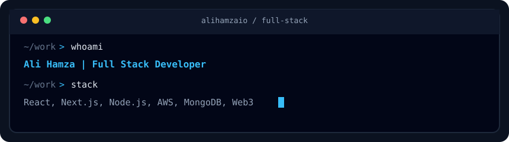

<div align="center">

# Ali Hamza
### Full Stack Developer in Lahore, Pakistan

[](https://alihamza-fawn.vercel.app/)



<br/>

[](https://alihamza-fawn.vercel.app/)
[](https://www.linkedin.com/in/alihamza-fullstack-developer)
[](mailto:hamzasarwer9@gmail.com)
[](https://github.com/alihamzaio)

</div>

---

## Who I am

I'm a **Full Stack Developer** based in **Lahore, Pakistan**. I build and ship real products, from the React/Next.js UI all the way through the Node.js API, database, and AWS deploy.

For the last **3+ years** I've worked with startups and product teams on MERN apps, serverless backends, and blockchain integrations. I care about clean APIs, fast frontends, and code that still makes sense six months later.

**Open to remote full-time and contract roles.**

Portfolio: [alihamza-fawn.vercel.app](https://alihamza-fawn.vercel.app/)  
LinkedIn: [alihamza-fullstack-developer](https://www.linkedin.com/in/alihamza-fullstack-developer)  
Email: [hamzasarwer9@gmail.com](mailto:hamzasarwer9@gmail.com)

---

## What I work on

| Focus | What that looks like day to day |
| --- | --- |
| **Full stack apps** | Next.js / React frontends wired to Node.js REST APIs |
| **Cloud and serverless** | AWS Lambda, API Gateway, DynamoDB, RDS, Terraform |
| **Data and workers** | MongoDB, PostgreSQL, Redis, BullMQ / background jobs |
| **Web3** | Wallet flows, Solidity integrations, blockchain indexing |

---

## Featured projects

| Project | What I built | Stack |
| --- | --- | --- |
| **[Portfolio](https://github.com/alihamzaio/portfolio)** | Personal site with SEO, CMS, and analytics. [Live demo](https://alihamza-fawn.vercel.app/) | Next.js, TypeScript, Tailwind |
| **Verana Indexer** | Blockchain crawler/indexer for 10k+ blocks, with about 90% fewer direct RPC reads | Node.js, Moleculer, BullMQ, PostgreSQL, Redis |
| **HealOps** | Multi-tenant healthcare and e-commerce platform on AWS serverless | Lambda, DynamoDB, RDS, Terraform |
| **UniLabs** | DeFi web app with wallet connect and on-chain reads | Next.js, Solidity, Ethers.js |
| **Senzi** | Dropshipping platform with 5k+ SKUs and supplier API automation | Next.js, Node.js, MongoDB |

More detail and case studies on my site: **[alihamza-fawn.vercel.app](https://alihamza-fawn.vercel.app/)**

---

## Tech stack

```text
Frontend   React.js · Next.js · TypeScript · Tailwind CSS · Redux
Backend    Node.js · Express.js · REST APIs · GraphQL · WebSockets
Data       MongoDB · PostgreSQL · Redis
Cloud      AWS (Lambda, API Gateway, DynamoDB, RDS) · Docker · Terraform · CI/CD
Web3       Solidity · Ethers.js · Blockchain indexing
```

<p align="center">
  
</p>

---

## How I like to work

- Ship end to end: design, API, deploy, then monitor
- Prefer simple, reliable architecture over flashy complexity
- Write APIs and UI that other developers can extend without digging through history
- Keep performance and SEO in mind from day one, especially on Next.js

---

## Let's talk

If you're hiring a **Full Stack Developer** (MERN / Next.js / AWS / Web3) for a remote team, or you need help shipping a product, feel free to reach out.

- Email: [hamzasarwer9@gmail.com](mailto:hamzasarwer9@gmail.com)
- [Portfolio](https://alihamza-fawn.vercel.app/) · [LinkedIn](https://www.linkedin.com/in/alihamza-fullstack-developer)

<div align="center">

**Thanks for stopping by.** Star the [portfolio repo](https://github.com/alihamzaio/portfolio) if it helped, or just say hi.

`Ali Hamza · Full Stack Developer · Lahore · Open to work`

</div>
